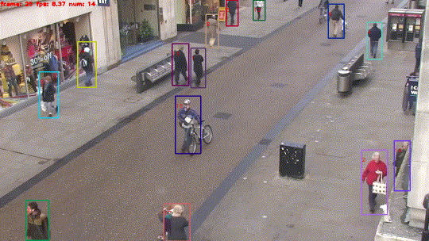
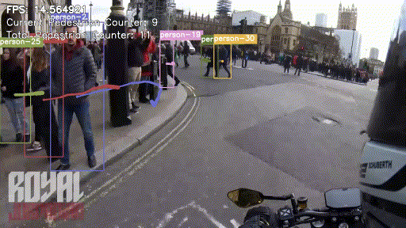
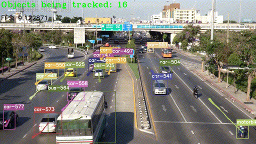

# Multi Object Tracking | Google-Colab 
Collection of papers, code, datasets, and other resources for multi object tracking | Google colab

### Joint-Detection

* **Tracking Objects as Points**
[ax2004]
[[pdf]](https://github.com/abhineet123/Deep-Learning-for-Tracking-and-Detection/blob/master/multi_object_tracking/joint_detection/Tracking%20Objects%20as%20Points%202004.01177.pdf)
[[notes]](https://github.com/abhineet123/Deep-Learning-for-Tracking-and-Detection/blob/master/multi_object_tracking/notes/Tracking%20Objects%20as%20Points%202004.01177.pdf)
[[code]](https://github.com/xingyizhou/CenterTrack)[pytorch]
* **DEFT: Detection Embeddings for Tracking**
[ax2102] 
[[arxiv]](http://arxiv.org/abs/2102.02267)
[pdf]
[notes]
[[code]](https://github.com/MedChaabane/DEFT)

#### Identity Embedding 

* **MOTS Multi-Object Tracking and Segmentation**
[cvpr19]
[[pdf]](https://github.com/abhineet123/Deep-Learning-for-Tracking-and-Detection/blob/master/multi_object_tracking/joint_detection/MOTS%20Multi-Object%20Tracking%20and%20Segmentation%20ax1904%20cvpr19.pdf)
[[notes]](https://github.com/abhineet123/Deep-Learning-for-Tracking-and-Detection/blob/master/multi_object_tracking/notes/MOTS%20Multi-Object%20Tracking%20and%20Segmentation%20ax1904%20cvpr19.pdf)
[[code]](https://github.com/VisualComputingInstitute/TrackR-CNN)
[[project/data]](https://www.vision.rwth-aachen.de/page/mots)

* **Towards Real-Time Multi-Object Tracking**
[ax1909]
[[arxiv]](https://arxiv.org/abs/1909.12605)
[[pdf]](https://github.com/abhineet123/Deep-Learning-for-Tracking-and-Detection/blob/master/multi_object_tracking/joint_detection/Towards%20Real-Time%20Multi-Object%20Tracking%20ax1909.12605v1.pdf)
[[notes]](https://github.com/abhineet123/Deep-Learning-for-Tracking-and-Detection/blob/master/multi_object_tracking/notes/Towards%20Real-Time%20Multi-Object%20Tracking%20ax1909.12605v1.pdf)
[[code]](https://github.com/Zhongdao/Towards-Realtime-MOT)

    * **Towards Real-Time Multi-Object Tracking - Vehicle Tracking**
    [[Modified version]](https://github.com/hardik0/Towards-Realtime-MOT/tree/detrac)
    

   

* **A Simple Baseline for Multi-Object Tracking**
[ax2004]
[[pdf]](https://github.com/abhineet123/Deep-Learning-for-Tracking-and-Detection/blob/master/multi_object_tracking/joint_detection/A%20Simple%20Baseline%20for%20Multi-Object%20Tracking%202004.01888.pdf)
[[notes]](https://github.com/abhineet123/Deep-Learning-for-Tracking-and-Detection/blob/master/multi_object_tracking/notes/A%20Simple%20Baseline%20for%20Multi-Object%20Tracking%202004.01888.pdf)
[[code]](https://github.com/ifzhang/FairMOT)

* **Integrated Object Detection and Tracking with Tracklet-Conditioned Detection**
[ax1811]
[[pdf]](https://github.com/abhineet123/Deep-Learning-for-Tracking-and-Detection/blob/master/multi_object_tracking/joint_detection/Integrated%20Object%20Detection%20and%20Tracking%20with%20Tracklet-Conditioned%20Detection%201811.11167.pdf)
[[notes]](https://github.com/abhineet123/Deep-Learning-for-Tracking-and-Detection/blob/master/multi_object_tracking/notes/Integrated%20Object%20Detection%20and%20Tracking%20with%20Tracklet-Conditioned%20Detection%201811.11167.pdf)

### Association

* **Deep Affinity Network for Multiple Object Tracking**
[ax1810/tpami19]
[[pdf]](https://github.com/abhineet123/Deep-Learning-for-Tracking-and-Detection/blob/master/multi_object_tracking/association/Deep%20Affinity%20Network%20for%20Multiple%20Object%20Tracking%20ax1810.11780%20tpami19.pdf)
[[notes]](https://github.com/abhineet123/Deep-Learning-for-Tracking-and-Detection/blob/master/multi_object_tracking/notes/Deep%20Affinity%20Network%20for%20Multiple%20Object%20Tracking%20ax1810.11780%20tpami19.pdf)
[[code]](https://github.com/shijieS/SST) [pytorch]

### Deep Learning

* **Online Multi-Object Tracking Using CNN-based Single Object Tracker with Spatial-Temporal Attention Mechanism**
[ax1708/iccv17]
[[pdf]](https://github.com/abhineet123/Deep-Learning-for-Tracking-and-Detection/blob/master/multi_object_tracking/deep_learning/Online%20Multi-Object%20Tracking%20Using%20CNN-based%20Single%20Object%20Tracker%20with%20Spatial-Temporal%20Attention%20Mechanism%201708.02843%20iccv17.pdf)
[[arxiv]](https://arxiv.org/abs/1708.02843)
[[notes]](https://github.com/abhineet123/Deep-Learning-for-Tracking-and-Detection/blob/master/multi_object_tracking/notes/Online%20Multi-Object%20Tracking%20Using%20CNN-based%20Single%20Object%20Tracker%20with%20Spatial-Temporal%20Attention%20Mechanism%201708.02843%20iccv17.pdf)
* **Online multi-object tracking with dual matching attention networks**
[ax1902/eccv18]
[[pdf]](https://github.com/abhineet123/Deep-Learning-for-Tracking-and-Detection/blob/master/multi_object_tracking/deep_learning/Online%20multi-object%20tracking%20with%20dual%20matching%20attention%20networks%201902.00749%20eccv18.pdf)
[[arxiv]](https://arxiv.org/abs/1902.00749)
[[notes]](https://github.com/abhineet123/Deep-Learning-for-Tracking-and-Detection/blob/master/multi_object_tracking/notes/Online%20multi-object%20tracking%20with%20dual%20matching%20attention%20networks%201902.00749%20eccv18.pdf)
[[code]](https://github.com/jizhu1023/DMAN_MOT)
* **FAMNet Joint Learning of Feature, Affinity and Multi-Dimensional Assignment for Online Multiple Object Tracking**
[iccv19]
[[pdf]](https://github.com/abhineet123/Deep-Learning-for-Tracking-and-Detection/blob/master/multi_object_tracking/deep_learning/FAMNet%20Joint%20Learning%20of%20Feature,%20Affinity%20and%20Multi-Dimensional%20Assignment%20for%20Online%20Multiple%20Object%20Tracking%20iccv19.pdf)
[[notes]](https://github.com/abhineet123/Deep-Learning-for-Tracking-and-Detection/blob/master/multi_object_tracking/notes/FAMNet%20Joint%20Learning%20of%20Feature,%20Affinity%20and%20Multi-Dimensional%20Assignment%20for%20Online%20Multiple%20Object%20Tracking%20iccv19.pdf)

* **Exploit the Connectivity: Multi-Object Tracking with TrackletNet**
[ax1811/mm19]
[[pdf]](https://github.com/abhineet123/Deep-Learning-for-Tracking-and-Detection/blob/master/multi_object_tracking/deep_learning/Exploit%20the%20Connectivity%20Multi-Object%20Tracking%20with%20TrackletNet%20ax1811.07258%20mm19.pdf)
[[notes]](https://github.com/abhineet123/Deep-Learning-for-Tracking-and-Detection/blob/master/multi_object_tracking/notes/Exploit%20the%20Connectivity%20Multi-Object%20Tracking%20with%20TrackletNet%20ax1811.07258%20mm19.pdf)
* **Tracking without bells and whistles**
[ax1903/iccv19]
[[pdf]](https://github.com/abhineet123/Deep-Learning-for-Tracking-and-Detection/blob/master/multi_object_tracking/deep_learning/Tracking%20without%20bells%20and%20whistles%20ax1903.05625%20iccv19.pdf)
[[notes]](https://github.com/abhineet123/Deep-Learning-for-Tracking-and-Detection/blob/master/multi_object_tracking/notes/Tracking%20without%20bells%20and%20whistles%20ax1903.05625%20iccv19.pdf)
[[code]](https://github.com/phil-bergmann/tracking_wo_bnw) [pytorch]

    * **Train object detector (Faster-RCNN with FPN) **

### RNN
* **Tracking The Untrackable: Learning To Track Multiple Cues with Long-Term Dependencies**
[ax1704/iccv17]
[Stanford]
[[pdf]](https://github.com/abhineet123/Deep-Learning-for-Tracking-and-Detection/blob/master/multi_object_tracking/rnn/Tracking%20The%20Untrackable%20Learning%20To%20Track%20Multiple%20Cues%20with%20Long-Term%20Dependencies%20ax17_4_iccv17.pdf)
[[notes]](https://github.com/abhineet123/Deep-Learning-for-Tracking-and-Detection/blob/master/multi_object_tracking/notes/Tracking_The_Untrackable_Learning_To_Track_Multiple_Cues_with_Long-Term_Dependencies.pdf)
[[arxiv]](https://arxiv.org/abs/1701.01909)
[[project]](http://web.stanford.edu/~alahi/),
* **Multi-object Tracking with Neural Gating Using Bilinear LSTM**
[eccv18]
[[pdf]](https://github.com/abhineet123/Deep-Learning-for-Tracking-and-Detection/blob/master/multi_object_tracking/rnn/Multi-object%20Tracking%20with%20Neural%20Gating%20Using%20Bilinear%20LSTM_eccv18.pdf)
[[notes]](https://github.com/abhineet123/Deep-Learning-for-Tracking-and-Detection/blob/master/multi_object_tracking/notes/Multi-object%20Tracking%20with%20Neural%20Gating%20Using%20Bilinear%20LSTM_eccv18.pdf)
* **Eliminating Exposure Bias and Metric Mismatch in Multiple Object Tracking**
[cvpr19]
[[pdf]](https://github.com/abhineet123/Deep-Learning-for-Tracking-and-Detection/blob/master/multi_object_tracking/rnn/Eliminating%20Exposure%20Bias%20and%20Metric%20Mismatch%20in%20Multiple%20Object%20Tracking%20cvpr19.pdf)
[[notes]](https://github.com/abhineet123/Deep-Learning-for-Tracking-and-Detection/blob/master/multi_object_tracking/notes/Eliminating%20Exposure%20Bias%20and%20Metric%20Mismatch%20in%20Multiple%20Object%20Tracking%20cvpr19.pdf)
[[code]](https://github.com/maksay/seq-train)

### Unsupervised Learning
* **Unsupervised Person Re-identification by Deep Learning Tracklet Association**
[ax1809/eccv18]
[[pdf]](https://github.com/abhineet123/Deep-Learning-for-Tracking-and-Detection/blob/master/multi_object_tracking/unsupervised/Unsupervised%20Person%20Re-identification%20by%20Deep%20Learning%20Tracklet%20Association%201809.02874%20eccv18.pdf)
[[notes]](https://github.com/abhineet123/Deep-Learning-for-Tracking-and-Detection/blob/master/multi_object_tracking/notes/Unsupervised%20Person%20Re-identification%20by%20Deep%20Learning%20Tracklet%20Association%201809.02874%20eccv18.pdf)
* **Tracking by Animation: Unsupervised Learning of Multi-Object Attentive Trackers**
[ax1809/cvpr19]
[[pdf]](https://github.com/abhineet123/Deep-Learning-for-Tracking-and-Detection/blob/master/multi_object_tracking/unsupervised/Tracking%20by%20Animation%20Unsupervised%20Learning%20of%20Multi-Object%20Attentive%20Trackers%20cvpr19%20ax1809.03137.pdf)
[[arxiv]](https://arxiv.org/abs/1809.03137)
[[notes]](https://github.com/abhineet123/Deep-Learning-for-Tracking-and-Detection/blob/master/multi_object_tracking/notes/Tracking%20by%20Animation%20Unsupervised%20Learning%20of%20Multi-Object%20Attentive%20Trackers%20cvpr19%20ax1809.03137.pdf)
[[code]](https://github.com/zhen-he/tracking-by-animation)
* **Simple Unsupervised Multi-Object Tracking**
[ax2006]
[[pdf]](https://github.com/abhineet123/Deep-Learning-for-Tracking-and-Detection/blob/master/multi_object_tracking/unsupervised/Simple%20Unsupervised%20Multi-Object%20Tracking%202006.02609.pdf)
[[notes]](https://github.com/abhineet123/Deep-Learning-for-Tracking-and-Detection/blob/master/multi_object_tracking/notes/Simple%20Unsupervised%20Multi-Object%20Tracking%202006.02609.pdf)

### Reinforcement Learning
* **Learning to Track: Online Multi-object Tracking by Decision Making**
[iccv15]
[Stanford]
[[pdf]](https://github.com/abhineet123/Deep-Learning-for-Tracking-and-Detection/blob/master/multi_object_tracking/rl/Learning%20to%20Track%20Online%20Multi-object%20Tracking%20by%20Decision%20Making%20%20iccv15.pdf)
[[notes]](https://github.com/abhineet123/Deep-Learning-for-Tracking-and-Detection/blob/master/multi_object_tracking/notes/Learning_to_Track_Online_Multi-object_Tracking_by_Decision_Making__iccv15.pdf)
[[code (matlab)]](https://github.com/yuxng/MDP_Tracking)
[[project]](https://yuxng.github.io/)
* **Collaborative Deep Reinforcement Learning for Multi-Object Tracking**
[eccv18]
[[pdf]](https://github.com/abhineet123/Deep-Learning-for-Tracking-and-Detection/blob/master/multi_object_tracking/rl/Collaborative%20Deep%20Reinforcement%20Learning%20for%20Multi-Object%20Tracking_eccv18.pdf)
[[notes]](https://github.com/abhineet123/Deep-Learning-for-Tracking-and-Detection/blob/master/multi_object_tracking/notes/Collaborative%20Deep%20Reinforcement%20Learning%20for%20Multi-Object%20Tracking_eccv18.pdf)

### Network Flow
* **Near-Online Multi-target Tracking with Aggregated Local Flow Descriptor**
[iccv15]
[NEC Labs]
[[pdf]](https://github.com/abhineet123/Deep-Learning-for-Tracking-and-Detection/blob/master/multi_object_tracking/network_flow/Near-online%20multi-target%20tracking%20with%20aggregated%20local%20%EF%AC%82ow%20descriptor%20iccv15.pdf)
[[author]](http://www-personal.umich.edu/~wgchoi/)
[[notes]](https://github.com/abhineet123/Deep-Learning-for-Tracking-and-Detection/blob/master/multi_object_tracking/notes/NOMT.pdf)  
* **Deep Network Flow for Multi-Object Tracking**
[cvpr17]
[NEC Labs]
[[pdf]](https://github.com/abhineet123/Deep-Learning-for-Tracking-and-Detection/blob/master/multi_object_tracking/network_flow/Deep%20Network%20Flow%20for%20Multi-Object%20Tracking%20cvpr17.pdf)
[[supplementary]](multi_object_tracking/network_flow/Deep%20Network%20Flow%20for%20Multi-Object%20Tracking%20cvpr17_supplemental.pdf)
[[notes]](https://github.com/abhineet123/Deep-Learning-for-Tracking-and-Detection/blob/master/multi_object_tracking/notes/Deep%20Network%20Flow%20for%20Multi-Object%20Tracking%20cvpr17.pdf)  
* **Learning a Neural Solver for Multiple Object Tracking**
[ax1912/cvpr20]
[[pdf]](https://github.com/abhineet123/Deep-Learning-for-Tracking-and-Detection/blob/master/multi_object_tracking/network_flow/Learning%20a%20Neural%20Solver%20for%20Multiple%20Object%20Tracking%201912.07515%20cvpr20.pdf)
[[notes]](https://github.com/abhineet123/Deep-Learning-for-Tracking-and-Detection/blob/master/multi_object_tracking/notes/Learning%20a%20Neural%20Solver%20for%20Multiple%20Object%20Tracking%201912.07515%20cvpr20.pdf)
[[code]](https://github.com/dvl-tum/mot_neural_solver)

### Graph Optimization
* **A Multi-cut Formulation for Joint Segmentation and Tracking of Multiple Objects**
[ax1607]
[highest MT on MOT2015]
[University of Freiburg, Germany]
[[pdf]](https://github.com/abhineet123/Deep-Learning-for-Tracking-and-Detection/blob/master/multi_object_tracking/batch/A%20Multi-cut%20Formulation%20for%20Joint%20Segmentation%20and%20Tracking%20of%20Multiple%20Objects%20ax16_9%20%5Bbest%20MT%20on%20MOT15%5D.pdf)
[[arxiv]](https://arxiv.org/abs/1607.06317)
[[author]](https://lmb.informatik.uni-freiburg.de/people/keuper/publications.html)
[[notes]](https://github.com/abhineet123/Deep-Learning-for-Tracking-and-Detection/blob/master/multi_object_tracking/notes/A_Multi-cut_Formulation_for_Joint_Segmentation_and_Tracking_of_Multiple_Objects.pdf)

### Baseline
* **Simple Online and Realtime Tracking**
[icip16]
[[pdf]](https://github.com/abhineet123/Deep-Learning-for-Tracking-and-Detection/blob/master/multi_object_tracking/baseline/Simple%20Online%20and%20Realtime%20Tracking%20ax1707%20icip16.pdf)
[[notes]](https://github.com/abhineet123/Deep-Learning-for-Tracking-and-Detection/blob/master/multi_object_tracking/notes/Simple%20Online%20and%20Realtime%20Tracking%20ax1707%20icip16.pdf)
[[code]](https://github.com/abewley/sort)
* **Simple Online and Realtime Tracking with a Deep Association Metric**
[icip17]
[[arxiv]](https://arxiv.org/abs/1703.07402)
[[code]](https://github.com/nwojke/deep_sort)
[[code2]](https://github.com/theAIGuysCode/yolov4-deepsort)

   
   

* **High-Speed Tracking-by-Detection Without Using Image Information**
[avss17]
[[pdf]](https://github.com/abhineet123/Deep-Learning-for-Tracking-and-Detection/blob/master/multi_object_tracking/baseline/High-Speed%20Tracking-by-Detection%20Without%20Using%20Image%20Information%20avss17.pdf)
[[notes]](https://github.com/abhineet123/Deep-Learning-for-Tracking-and-Detection/blob/master/multi_object_tracking/notes/High-Speed%20Tracking-by-Detection%20Without%20Using%20Image%20Information%20avss17.pdf)
[[code]](https://github.com/bochinski/iou-tracker)

### Metrics
* **HOTA A Higher Order Metric for Evaluating Multi-object Tracking**
[ijcv20/08]
[[pdf]](https://github.com/abhineet123/Deep-Learning-for-Tracking-and-Detection/blob/master/multi_object_tracking/metrics/HOTA%20A%20Higher%20Order%20Metric%20for%20Evaluating%20Multi-object%20Tracking%20sl_open_2010_ijcv2008.pdf)
[[notes]](https://github.com/abhineet123/Deep-Learning-for-Tracking-and-Detection/blob/master/multi_object_tracking/notes/HOTA%20A%20Higher%20Order%20Metric%20for%20Evaluating%20Multi-object%20Tracking%20sl_open_2010_ijcv2008.pdf)
[[code]](https://github.com/JonathonLuiten/HOTA-metrics)

## Multi Object Tracking Datasets

- [IDOT](https://www.cs.uic.edu/Bits/YanziJin)
- [UA-DETRAC Benchmark Suite](http://detrac-db.rit.albany.edu/)
- [GRAM Road-Traffic Monitoring](http://agamenon.tsc.uah.es/Personales/rlopez/data/rtm/)
- [Stanford Drone Dataset](http://cvgl.stanford.edu/projects/uav_data/)
- [Ko-PER Intersection Dataset](http://www.uni-ulm.de/in/mrm/forschung/datensaetze.html)
- [TRANCOS](http://agamenon.tsc.uah.es/Personales/rlopez/data/trancos/)
- [Urban Tracker](https://www.jpjodoin.com/urbantracker/dataset.html)
- [DARPA VIVID / PETS 2005](http://vision.cse.psu.edu/data/vividEval/datasets/datasets.html) [Non stationary camera]
- [KIT-AKS](http://i21www.ira.uka.de/image_sequences/) [No ground truth]
- [CBCL StreetScenes Challenge Framework](http://cbcl.mit.edu/software-datasets/streetscenes/) [No top down viewpoint]
- [MOT 2015](https://motchallenge.net/data/2D_MOT_2015/) [mostly street level viewpoint]
- [MOT 2016](https://motchallenge.net/data/MOT16/) [mostly street level viewpoint]
- [MOT 2017](https://motchallenge.net/data/MOT17/) [mostly street level viewpoint]
- [MOT 2020](https://motchallenge.net/data/MOT20/) [mostly top down  viewpoint]
- [MOTS: Multi-Object Tracking and Segmentation](https://www.vision.rwth-aachen.de/page/mots) [MOT and KITTI]
- [CVPR 2019](https://motchallenge.net/data/11) [mostly street level viewpoint]
- [PETS 2009](http://www.cvg.reading.ac.uk/PETS2009/a.html) [No vehicles]
- [PETS 2017](https://motchallenge.net/data/PETS2017/) [Low density] [mostly pedestrians]
- [DukeMTMC](http://vision.cs.duke.edu/DukeMTMC/) [multi camera] [static background] [pedestrians] [above-street level viewpoint] [website not working]
- [KITTI Tracking Dataset](http://www.cvlibs.net/datasets/kitti/eval_tracking.php) [No top down viewpoint] [non stationary camera]
- [The WILDTRACK Seven-Camera HD Dataset](https://cvlab.epfl.ch/data/data-wildtrack/) [pedestrian detection and tracking]
- [3D Traffic Scene Understanding from Movable Platforms](http://www.cvlibs.net/projects/intersection/) [intersection traffic] [stereo setup] [moving camera]
- [LOST : Longterm Observation of Scenes with Tracks](http://lost.cse.wustl.edu/) [top down and street level viewpoint] [no ground truth]
- [JTA](http://imagelab.ing.unimore.it/imagelab/page.asp?IdPage=25) [top down and street level viewpoint] [synthetic/GTA 5] [pedestrian] [3D annotations]
- [PathTrack: Fast Trajectory Annotation with Path Supervision](http://people.ee.ethz.ch/~daid/pathtrack/) [top down and street level viewpoint] [iccv17] [pedestrian] 
- [CityFlow](https://www.aicitychallenge.org/) [pole mounted] [intersections] [vehicles] [re-id]  [cvpr19]
- [UAVDT - The Unmanned Aerial Vehicle Benchmark: Object Detection and Tracking](https://sites.google.com/site/daviddo0323/projects/uavdt) [uav] [intersections/highways] [vehicles]  [eccv18]
- [JackRabbot Dataset ](https://jrdb.stanford.edu/)  [RGBD] [head-on][indoor/outdoor][stanford]
- [TAO: A Large-Scale Benchmark for Tracking Any Object ](http://taodataset.org/)  [eccv20] [[code]](https://github.com/TAO-Dataset/tao)

## Acknowledgements

- Part of README.md is borrowed from the [Deep-Learning-for-Tracking-and-Detection](https://github.com/abhineet123/Deep-Learning-for-Tracking-and-Detection)
check out this amazing github repo for other detection & tracking resources.

